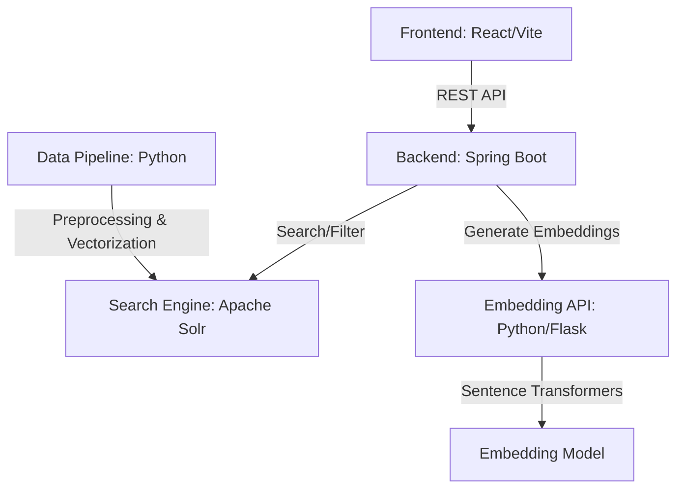

# SC4021-Assignment

## Project Overview


## System Architecture

The application follows a microservices-inspired architecture to separate concerns and optimize performance:



## Running the Application
### 1. Solr Setup
Ensure Apache Solr is running on your machine.
- Start Solr: `bin/solr start`
- Create the required core: `bin/solr create -c youtube_comments`

### 2. Embedding API (Python)
This service must be running for both indexing and searching to work correctly.
```bash
# From the root directory
source .venv/bin/activate
pip install flask sentence-transformers
python embedding_api.py
```
*Note: The service runs on `http://localhost:5000`.*

### 3. Backend (Java/Spring Boot)
The backend manages the communication between the frontend and Solr, and interfaces with the embedding service.
```bash
cd Backend
./mvnw spring-boot:run
```
*Note: The backend runs on `http://localhost:8081`.*

### 4. Frontend (React/Vite)
The user interface for searching and visualizing results.
```bash
cd Frontend
npm install
npm run dev
```
*Note: The frontend runs on `http://localhost:5173`.*

## Data Pipeline & Indexing

To populate the system with data, run the indexing script which handles text cleaning, vector embedding generation, and classification:

```bash
python index_actual_data.py
```
*Note: Ensure Solr and the Embedding API are running before starting the indexing process.*
