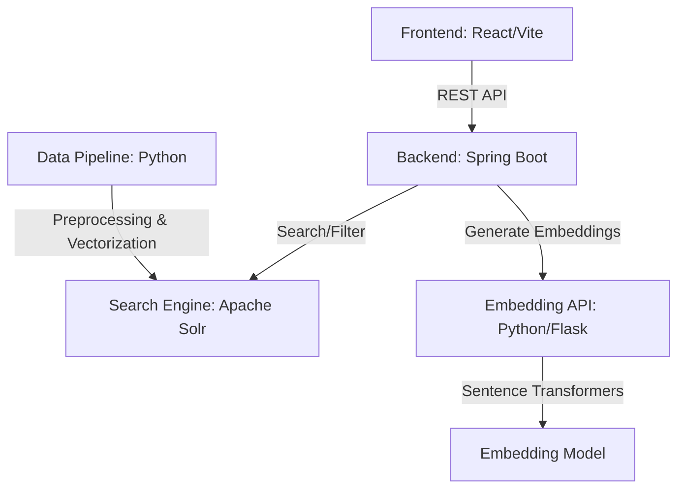

# SC4021-Assignment

## Project Overview
This project develops an search engine for exploring public perspectives on the death penalty using YouTube comments as the primary data source. It combines Apache Solr with hybrid search, fuzzy matching, and advanced filtering for effective information retrieval. A hierarchical sentiment analysis pipeline enhanced with hybrid features and stacked ensemble models improves classification performance. The system is deployed as a full-stack web application with interactive visualizations for deeper insight.

## Youtube Link - https://www.youtube.com/watch?v=IyyyV28RZY8

## System Architecture

The application follows a microservices-inspired architecture to separate concerns and optimize performance:


## Crawling
This Python-based YouTube crawler collects and labels comments from videos related to the topic:

"Is the death penalty good or bad?"

The script uses the YouTube Data API to:

Search for relevant videos
Extract comments from those videos
Filter for English comments only
Automatically label sentiment (positive / negative)
Save the dataset into a CSV file

Some features that comes with this crawler are:
Video Search using keyword query
Large-scale comment extraction
Language filtering
Rule-based sentiment labeling
Duplicate removal
CSV dataset export

Python libraries/tools used:
googleapiclient (YouTube Data API)
pandas
langdetect

The generated CSV file: youtube_death_penalty_dataset.csv

Contains the following columns:

comment - The text of the YouTube comment
video_link - Link to the source video
likes - Number of likes on the comment
published_at - Timestamp of the comment
sentiment - Label: positive or negative

How It Works:

1. Video Retrieval
Searches YouTube using the query: Is the death penalty good or bad
Collects up to 1000 videos

2. Comment Extraction
Retrieves top-level comments from each video
Skips videos with disabled comments

3. Language Filtering
Uses langdetect to keep only English comments

4. Sentiment Labeling

Rule-based classification using keyword matching:

Positive keywords:

support, agree, good, necessary, deserve, justice, deterrent, etc.

Negative keywords:

against, wrong, inhumane, cruel, abolish, barbaric, etc.

Comments without matching keywords are discarded.

5. Dataset Creation
Stops when 20,000 labeled comments are collected
Removes duplicate comments
Saves results to CSV

Installation:

Install required dependencies:
pip install pandas google-api-python-client langdetect

Setup (Very important!):

Get a YouTube Data API key from: https://console.cloud.google.com/
Replace the API key in the script:
API_KEY = "ENTER_API_KEY_HERE"

Usage:

Run the script: 
python crawler_V3.py

You will see progress logs like: 12/1000 videos processed | collected: 3500


## Running the Application
### 1. Solr Setup
Ensure Apache Solr is running on your machine.
- Start Solr: `bin/solr start`
- Create the required core: `bin/solr create -c youtube_comments`
- Run the following command in powershell to insert the schema.
```powershell
curl.exe http://localhost:8983/solr/youtube_comments/schema `
  -X POST `
  -H "Content-type:application/json" `
  --data-binary "@yt_comments_schema.json"
```

### 2. Embedding API (Python)
This service must be running for both indexing and searching to work correctly.
```bash
# From the root directory
source .venv/bin/activate
pip install flask sentence-transformers
python embedding_api.py
```
*Note: The service runs on `http://localhost:5000`.*

### 3. Backend (Java/Spring Boot)
The backend manages the communication between the frontend and Solr, and interfaces with the embedding service.
```bash
cd Backend
./mvnw spring-boot:run
```
*Note: The backend runs on `http://localhost:8081`.*

### 4. Frontend (React/Vite)
The user interface for searching and visualizing results.
```bash
cd Frontend
npm install
npm run dev
```
*Note: The frontend runs on `http://localhost:5173`.*

## Data Pipeline & Indexing

To populate the system with data, run the indexing script which handles text cleaning, vector embedding generation, and classification:

```bash
python index_actual_data.py
```
*Note: Ensure Solr and the Embedding API are running before starting the indexing process.*


## Classification Question  4 (How to Run Evaluation of Dataset)

1) Download eval.csv & rest_of_data.csv
2) Download eval.ipynb
3) Ensure all the files above are in the same directory
4) Click Run on Jupyter Notebook (eval.ipynb)


## Classification Enhancements 

## 1. Dependencies
Install the required Python packages before running the script.
```bash
pip install numpy pandas scikit-learn scipy
```
### Optional dependency
For the VADER sentiment feature:
```bash
pip install vaderSentiment
```
If `vaderSentiment` is not installed, the code still runs. The VADER feature is simply set to `0.0` for all samples.

---

## 2. How to Run
1. Place the dataset file in the same folder as the Python script.
2. Make sure the dataset filename matches:
```python
DATA_PATH = "youtube_death_penalty_dataset.csv"
```
3. Run the script:
```bash
python your_script_name.py
```
Replace `your_script_name.py` with the actual filename of your Python file.

---

## 3. What the Script Outputs
The script prints:
- dataset size
- label distribution
- training progress for each model
- accuracy for each model
- macro-F1 for each model
- full classification report
- confusion matrix
- final summary table for the ablation study

### Evaluation metrics

#### Accuracy
The proportion of total predictions that are correct.

#### Macro-F1
The average F1-score across both classes, giving equal importance to `positive` and `negative`.
Macro-F1 is especially useful when checking whether the model performs well on both classes rather than just one.

---

## 4. Ablation Study Setup
The code is structured to support a clear comparison of feature/model design choices.
The ablation study compares:
1. **Baseline**: word TF-IDF + Logistic Regression
2. **Hybrid**: word TF-IDF + char TF-IDF + symbolic features
3. **Ensemble**: stacked text-based models
4. **Combined**: hybrid model inside a stacked ensemble

This lets justifies whether each added technique actually improves performance.


